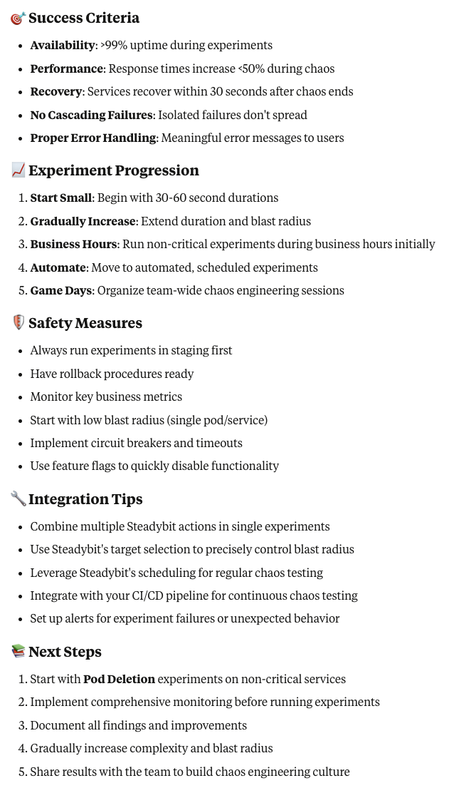

# Examples

## Team activity summary

**Tool**: Claude Desktop using Claude Sonnet 4

**Prompt**: Can you have a look at the executions of team "GITHUB" in Steadybit? Can you summarize some trends? Please
consider the last 1000 executions.

### Results

<a href="team-activity-1-summary.png" target="_blank"></img></a>

<a href="team-activity-2-overview.png" target="_blank"></img></a>
<a href="team-activity-3-state-analysis.png" target="_blank"></img></a>
<a href="team-activity-4-environment-usage.png" target="_blank"></img></a>

<a href="team-activity-5-type-analysis.png" target="_blank"></img></a>
<a href="team-activity-6-trends-insights.png" target="_blank"></img></a>
<a href="team-activity-7-recommendations.png" target="_blank"></img></a>

## Team trends

**Tool**: Claude Desktop using Claude Sonnet 4

**Prompt**: Looking at the latest executions of team GITHUB, did the stability of executions improve in the last 2
weeks, compared to the 2 weeks before? Please consider all executions.

### Results

<a href="team-trend-1.png" target="_blank"></img></a>

## Experiment suggestions

**Tool**: Claude Desktop using Claude Sonnet 4

**Prompt**:

I am an SRE, hosting a couple of java applications in kubernetes. Each of the application is providing a few
microservices. Some of the applications are using a AWS RDS database. There is a javascript UI talking to those
microservices. Please have a look at the available actions in Steadybit and suggest some chaos engineering experiments
to start with.

### Results

<a href="suggestions-1-phase-1.png" target="_blank"></img></a>
<a href="suggestions-2-phase-2.png" target="_blank"></img></a>
<a href="suggestions-3-phase-3.png" target="_blank"></img></a>

<a href="suggestions-4-phase-4.png" target="_blank"></img></a>
<a href="suggestions-5-phase-5.png" target="_blank"></img></a>
<a href="suggestions-5-verification.png" target="_blank"></img></a>

<a href="suggestions-6-misc.png" target="_blank"></img></a>